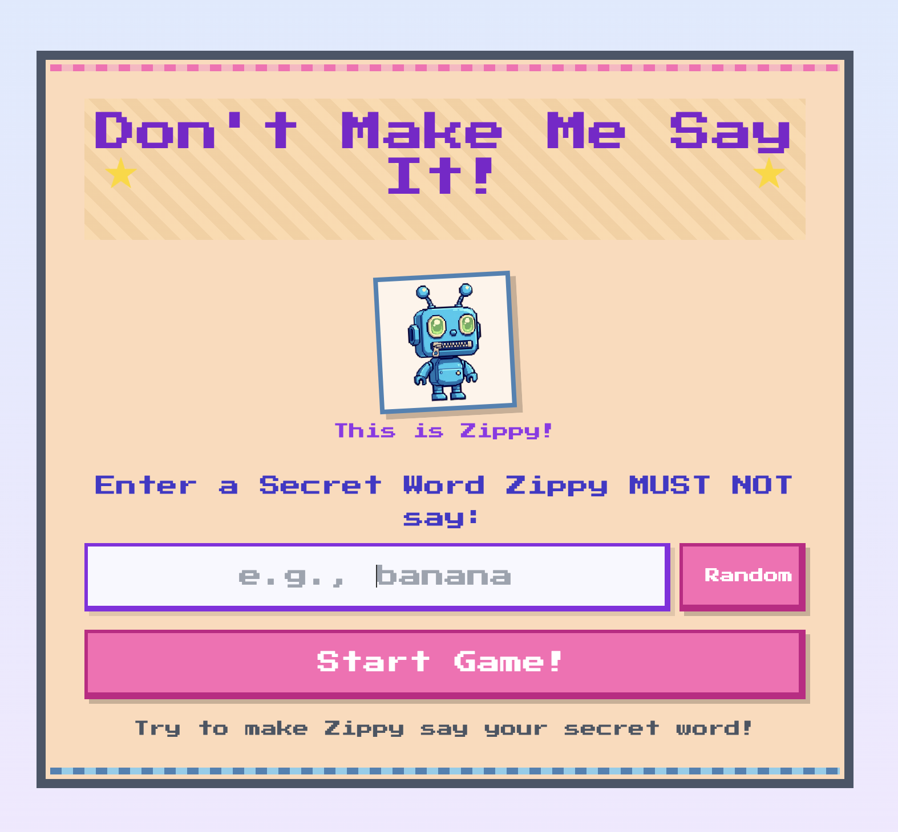

# Don't Make Me Say It!

A fun word game where you try to make Zippy say a secret word.

## Features

- Interactive game with a playful AI character
- Pixel art styling with retro game aesthetics
- Responsive design that works on desktop and mobile
- Integration with Perplexity AI API
- Exact word matching to ensure fair gameplay

## Screenshot



*Above: Example gameplay screen of "Don't Make Me Say It!"*

## Project Slide Deck

For a visual and conceptual overview of the project, see the slide presentation:

[Project Description Slides (Google Slides)](https://docs.google.com/presentation/d/14OrOqeAf2T___-KmCcb5rCqL2nj7vgCRrqOoJuIZSWg/edit?slide=id.g35d2d124b20_0_463#slide=id.g35d2d124b20_0_463)

## Prerequisites

- Node.js (v14 or higher)
- Perplexity API key

## Setup

1. Clone this repository
2. Install dependencies:
   ```
   npm install
   ```
3. Configure your Perplexity API key:
   - Open the `config.json` file
   - Add your Perplexity API key: `"PERPLEXITY_API_KEY": "your_perplexity_api_key_here"`

## How to Play

1. Start the server:
   ```
   npm start
   ```
   Or for development with auto-restart:
   ```
   npm run dev
   ```

2. Open your browser and navigate to:
   ```
   http://localhost:3000
   ```

3. Enter a secret word that Zippy must not say
4. Try to trick Zippy into saying your secret word through conversation
5. If Zippy says the word, you win! If Zippy avoids saying it for 10 rounds, Zippy wins!

## Game Rules

- You choose a secret word that Zippy must avoid saying
- Each round, you ask Zippy a question trying to trick it into saying the word
- Zippy will respond while trying to avoid using your secret word
- If Zippy says the exact word (not as part of another word), you win
- If Zippy avoids saying the word for 10 rounds, Zippy wins
- Zippy will concede if your questions narrow down to where only the secret word fits

## Example Gameplay

Secret Word: Apple

User: What fruit is sweet and can be made into cider?
Zippy: Pear. Pears are sweet fruits that can be made into cider, known as "perry".

User: The fruit is also the name of a tech company.
Zippy: Orange. Orange is both a sweet fruit that can be made into cider and was also the name of a cellphone network company.

User: The word starts with an A.
Zippy: Alright, you win—it's apple! I've been cornered here, as you've narrowed it down to a fruit that starts with "A," can be made into cider, and is the name of a tech company. Well played!

## Project Structure

- `server.js` - Express server and Perplexity API integration
- `prompts.js` - System prompts for the game
- `config.json` - Configuration file for API keys
- `public/` - Frontend assets
  - `index.html` - Game UI
  - `styles.css` - Pixel art and game styling
  - `app.js` - Game logic

## Getting a Perplexity API Key

1. Visit the [Perplexity API](https://www.perplexity.ai/api) website
2. Sign up for an account
3. Navigate to your account settings to create an API key
4. Copy the key and add it to your `config.json` file

## Technical Details

- The game uses the Perplexity AI API with the "sonar-pro" model
- Messages are formatted in the OpenAI-compatible format that Perplexity requires
- The word detection algorithm uses exact word matching to prevent false positives
- The UI features pixel art styling and animations for a retro game feel
